
 
  <h1>Chatlla</h1>

 

  
  
  
  
  
  

  

## ✅ Índice
- <a href="#sobre">Sobre o Projeto</a>
- <a href="#como_acessar">Como Acessar o Projeto</a>
- <a href="#status_projeto">Status do Projeto</a>
- <a href="#funcionalidades">Funcionalidades</a>
  - <a href="#userflow">Fluxo do Usuário - User Flow</a>
- <a href="#pre-requisitos-como-rodar">Pré-requisitos e como rodar o projeto</a>
- <a href="#tecnologias-ferramentas">Tecnologias e Ferramentas Utilizadas</a>
- <a href="#funcionalidades-futuras">Roadmap de funcionalidades futuras</a>
- <a href="#autor">Autor</a>
- <a href="#licença">Licença</a>

<h2 id="sobre">📝 Sobre o Projeto</h2>

Hoje em dia, existem diversos meios de comunicação, e aplicativos de chat se tornaram bastante populares. No entanto, muitas vezes não queremos ou não podemos enviar uma mensagem de áudio, e digitar letra por letra pode ser cansativo e demandar muito tempo. Além disso, muitas pessoas têm dificuldades para digitar, seja por diversidade funcional ou outras razões.

O Chatlla busca resolver esses problemas, oferecendo uma plataforma de mensagens instantâneas fluida e acessível, que pode ser usada em qualquer dispositivo com acesso à internet, independentemente do sistema operacional, contando ainda com termos e condições de uso e política de privacidade, visando garantir a segurança e transparência para seus usuários.

Uma das principais ferramentas que o Chatlla oferece é a transcrição de voz em texto, que permite que os usuários falem em vez de digitar suas mensagens. Essa funcionalidade é especialmente útil para pessoas com dificuldades para digitar ou com diversidade funcional que limita o uso do teclado. Além disso, é uma ótima opção para situações em que não é possível digitar, como quando se está em movimento ou não se tem as mãos livres e até quando temos uma ideia genial mas se não escrevê-la logo acabamos deixando passar algum detalhe . Com o Chatlla, é fácil se comunicar de maneira rápida e eficiente.

## <h2 id="como_acessar">📁 Como Acessar o Projeto</h2>
O projeto pode ser acessado através do link https://chatlla.learnadvancedreact.com.br/ .

## <h2 id="status_projeto">👨‍💻 Status do Projeto</h2>
Em desenvolvimento 

## <h2 id="funcionalidades">🎨 Funcionalidades</h2>

#### Cadastro e Login
> Criar uma conta e fazer login é super simples. Você pode acessar a plataforma em poucos cliques e começar a usar imediatamente.

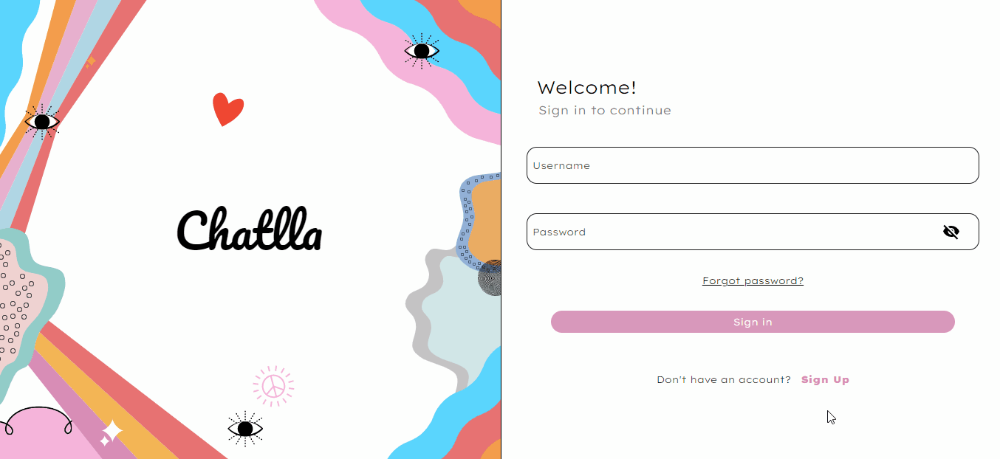
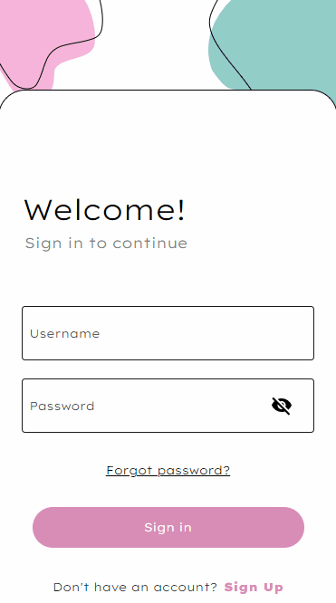

#### Validador de força de senha
> Quando você se cadastra no Chatlla, a plataforma oferece um validador de força de senha para auxiliar na criação de senhas seguras e proteger sua conta.

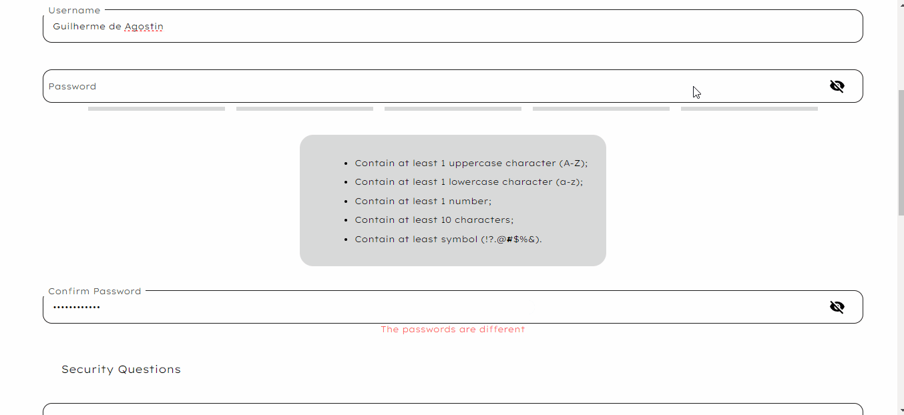
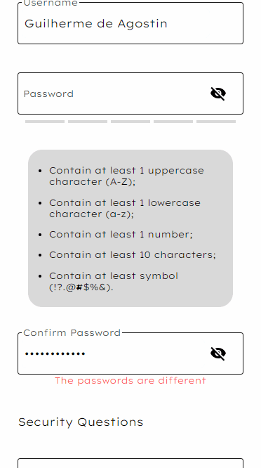

#### Definição de foto de perfil
> Você pode escolher sua foto de perfil, permitindo que outros usuários possam identificá-lo facilmente.

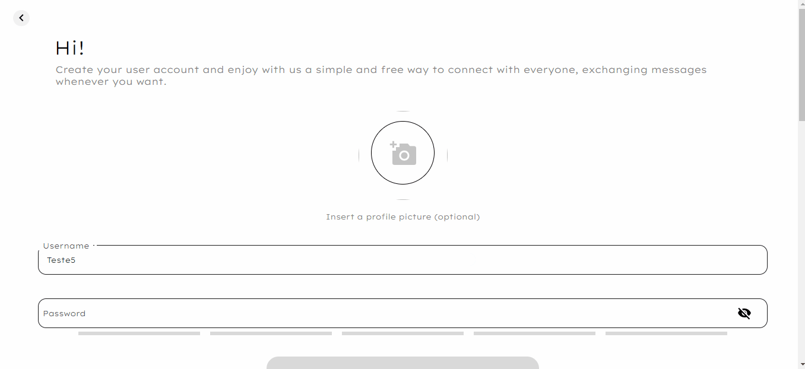
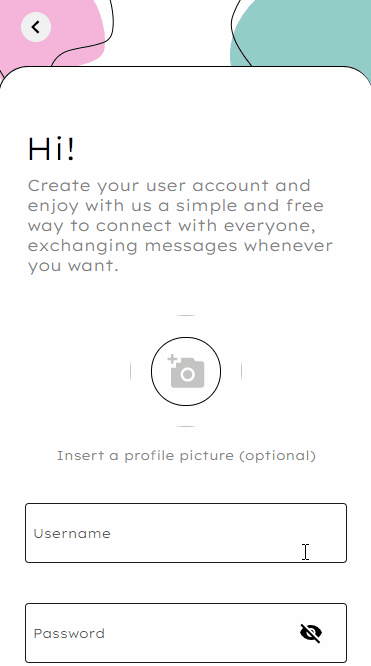

 

#### Edição de perfil
> Você pode editar suas informações de perfil, como nome de usuário e senha, a qualquer momento.

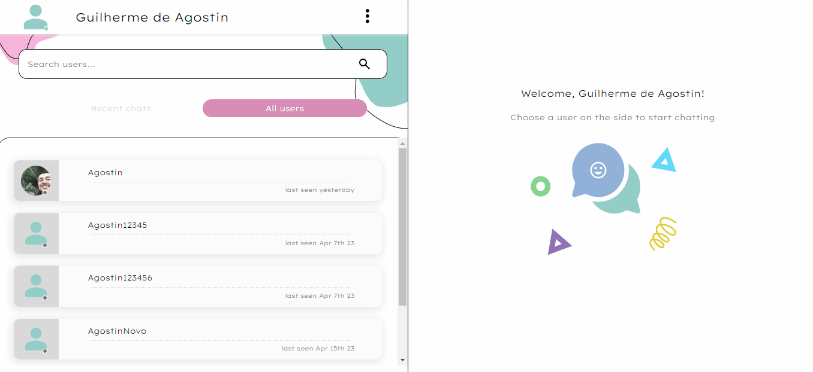

 

#### Visualização de usuários conectados
> O Chatlla exibe todos os usuários conectados, permitindo que você encontre facilmente amigos e familiares que estão online e que você possa conversar com eles em tempo real.

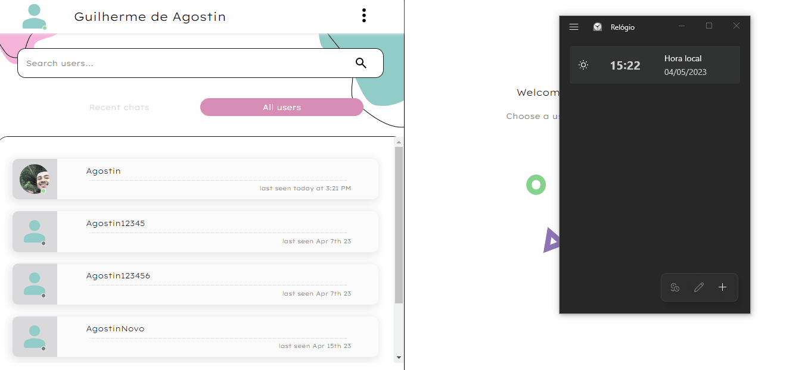
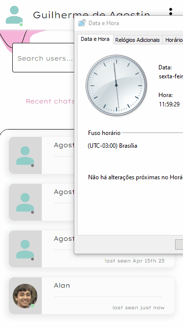

 

#### Troca de mensagens em tempo real
> Os usuários podem enviar e receber mensagens em tempo real.

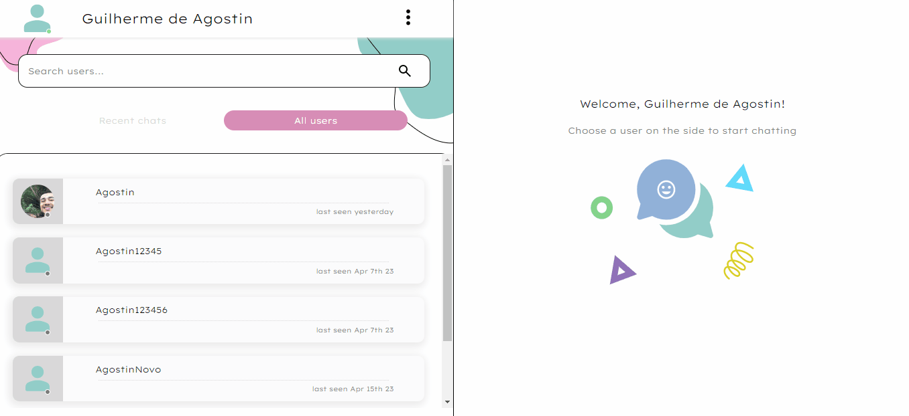
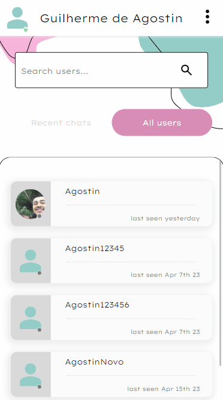

 

#### Compartilhamento de fotos
> Você pode compartilhar fotos dentro do chat, para que você e seus amigos possam compartilhar momentos especiais e engraçados.

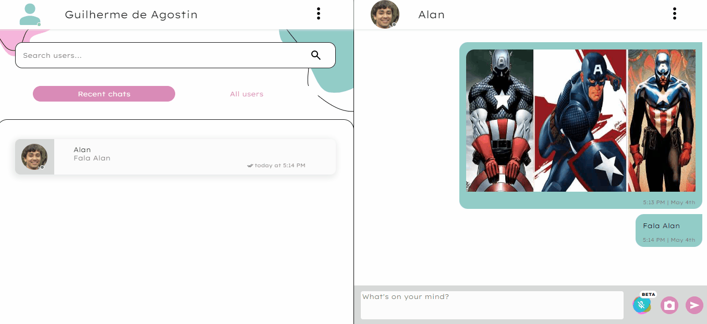
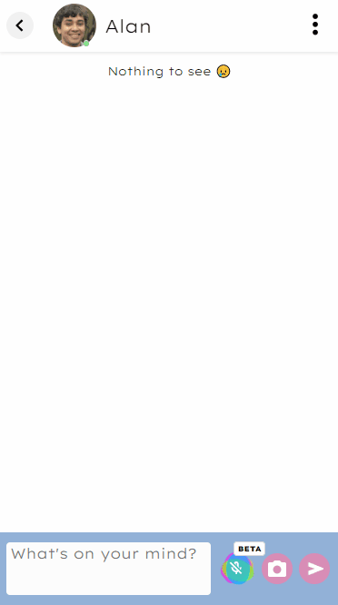

 

_Nota: As imagens dos heróis foram obtidas nos sites [Animated Times](https://animatedtimes.com/wp-content/uploads/2020/04/captain-america-best-costumes.jpg), [SlideShare](https://image.slidesharecdn.com/mask-140603215655-phpapp02/75/mask-painting-1-2048.jpg?cb=1669367850) e [9GAG](https://img-9gag-fun.9cache.com/photo/aR7YX2A_700bwp.webp)._

#### Transcrição de áudio em texto
> Os usuários podem enviar áudio para que o Chatlla o transcreva em texto, tornando a comunicação mais rápida e acessível.

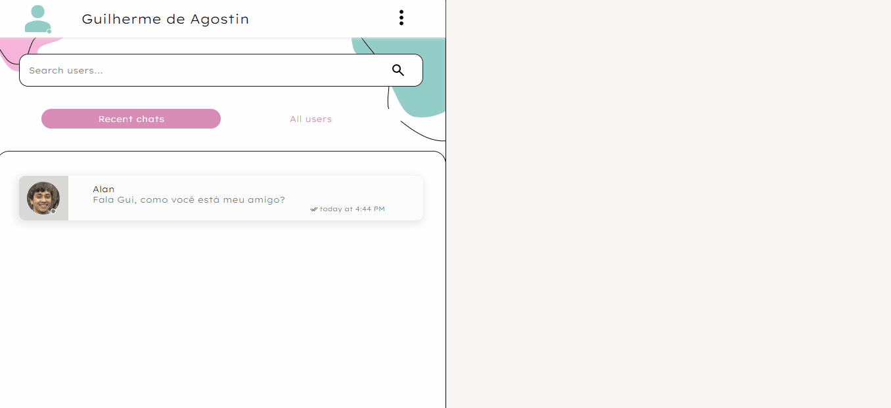
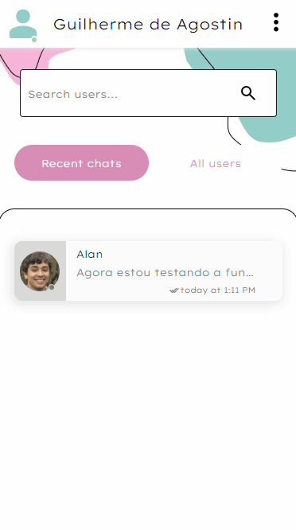

 

#### UI/UX intuitivo
> Desenvolvido com foco na melhor experiência do usuário, apresentando uma interface intuitiva e amigável.

#### Utilização de cookies
> O Chatlla utiliza cookies para melhorar a experiência do usuário e garantir a segurança e transparência dos dados.

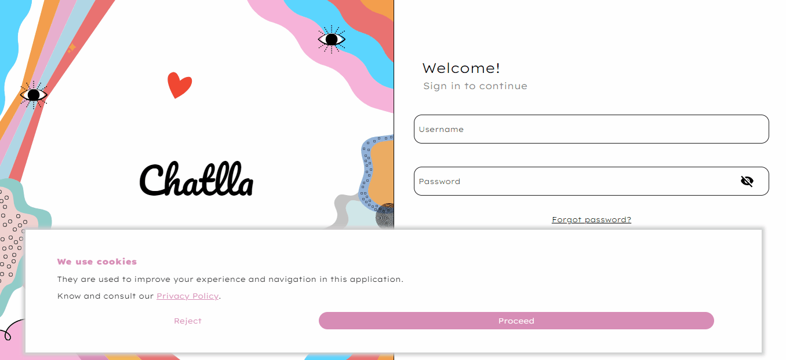
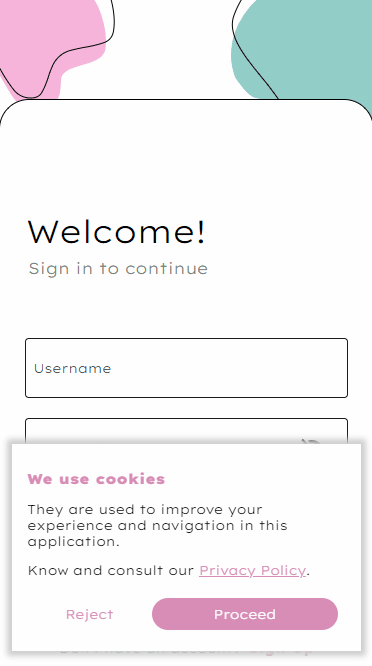

### <h3 id="userflow">🔄 Fluxo do Usuário - User Flow</h3>
Para visualizar todas as features necessárias, elaborei um pequeno fluxograma que apresenta as principais ações que o usuário pode realizar na plataforma.
 
 

## <h2 id="pre-requisitos-como-rodar">✔ Pré-requisitos e como rodar o projeto</h2>
De início, você vai precisar ter instalado em sua máquina as seguintes ferramentas:
- [Git](https://git-scm.com)
- [Node.js](https://nodejs.org/en/)

Além disso é bom ter um editor para trabalhar com o código como [VSCode](https://code.visualstudio.com/).

Agora para rodar o projeto é necessário seguir os seguintes passos:

    # Clonar o repositório
    $ git clone <https://github.com/GuilhermeAgostin/Chatlla.git>

    # Acessar a pasta do projeto no terminal/cmd
    $ cd chatlla

    # Instalar as dependências
    $ npm install
      
    # Iniciar o projeto em modo de desenvolvimento
    $ npm run dev

    # O servidor inciará na porta:5173 - acesse <http://localhost:5173/>

## <h2 id="tecnologias-ferramentas">🔧 Tecnologias e Ferramentas Utilizadas</h2>
<!--ts-->
* [React.JS](https://react.dev/) : uma biblioteca JavaScript para construção de interfaces de usuário reativas e eficientes - usada para o desenvolvimento do front-end.
* [HTML](https://developer.mozilla.org/pt-BR/docs/Web/HTML) : linguagem de marcação que define a estrutura do site - usada para estruturação do site.
* [CSS](https://developer.mozilla.org/pt-BR/docs/Web/CSS) : linguagem de estilo utilizada para aprimorar a apresentação do site -  usada para estilização do site.
* [Firebase/Firestore](https://firebase.google.com/docs/firestore?hl=pt-br) : Firebase é uma plataforma do Google que oferece diversos serviços para desenvolvimento de aplicativos. O Firestore é um banco de dados NoSQL em tempo real oferecido pelo Firebase, que permite o armazenamento, sincronização e consulta de dados de maneira escalável e segura - usado como base de dados para armazenar informações dos usuários e mensagens trocadas no Chatlla.
* [Vite](https://vitejs.dev/) : ferramenta de construção para otimização e empacotamento de código JavaScript, CSS e HTML - usado como ferramenta de build.
<!--te-->

## <h2 id="funcionalidades-futuras">💫 Roadmap de funcionalidades futuras</h2>

O Chatlla tem o comprometimento de melhorar constantemente, trazendo novas funcionalidades e aprimoramentos. Fique ligado para as próximas atualizações!

- [ ] Transcrição de áudio em texto para dispositivos Android
> Os usuários que acessarem a plataforma a partir de um dispositivo Android terão acesso à funcionalidade de transcrição de áudio em texto. Isso permitirá que eles enviem áudios que serão automaticamente transcritos em texto.

- [ ] Transcrição de áudio em texto em Inglês
> Os usuários poderão enviar áudios em Inglês que serão transcritos em texto automaticamente pela plataforma, também em Inglês.

- [ ] Envio de áudio
> Com esta nova funcionalidade, os usuários poderão enviar mensagens de áudio para seus amigos e familiares no Chatlla.

- [ ] Notificações de mensagens não lidas
> Os usuários receberão notificações quando receberem novas mensagens não lidas no Chatlla. 

## <h2 id="autor">✔ Autor</h2>

Feito com 🔎, 💪 e 🙏 por Guilherme de Agostin 👋 Entre em contato!

## <h2 id="licença">📜 Licença</h2>
Este projeto está licenciado sob a Licença Apache, Versão 2.0 - consulte o arquivo [LICENSE](./LICENSE) para obter detalhes.

  Este projeto é de código aberto. Seu código fonte pode ser usado, modificado e distribuído , desde que sigam certas condições como dar crédito ao autor original e incluir uma cópia da licença em qualquer distribuição do software.

